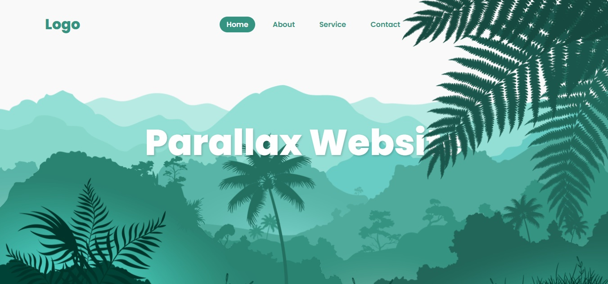
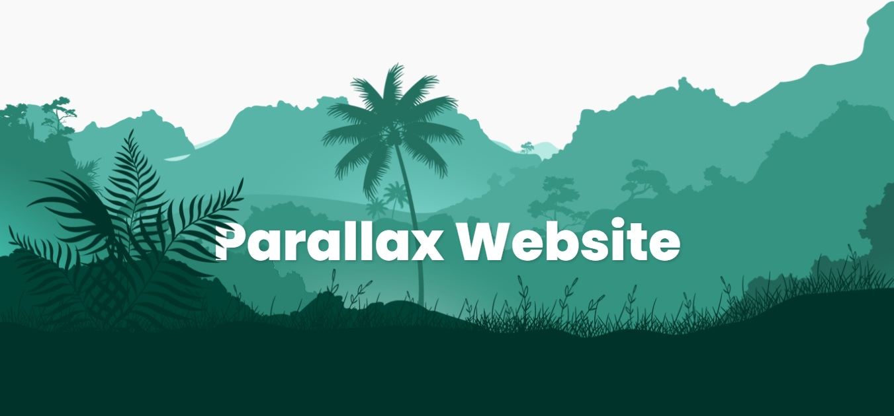

# 🏔️ Modern CSS Parallax Scrolling Website

<p align="center">
  
</p>

---

### 🌟 Overview
Welcome to the **CSS Parallax Scrolling Website**! This project demonstrates how to create a dynamic "3D depth" effect on a 2D web page. By using **Vanilla JavaScript** to manipulate multiple image layers at different speeds during scroll, we achieve a high-end visual experience.

[📺 Watch Live Demo](https://juniordevelopper.github.io/CSS-Parallax-Scrolling-Website/)

---

### 🎨 Visual Preview


| 🖼️ Initial View | 🌀 Scrolled View |
| :---: | :---: |
|  |  |
| *Hero section before scrolling* | *Elements moving apart during scroll* |

---

### 🚀 Key Features
- 💎 **Parallax Engine:** Smooth multi-layer movement using `window.scrollY` and CSS absolute positioning.
- ⚡ **Performance Optimized:** Uses `pointer-events: none` to ensure seamless interaction with background layers.
- 🎨 **Modern UI:** Clean typography with Google Fonts (Poppins) and a dark-themed content section.
- 📱 **Responsive Design:** Fluid layout that adapts to different viewport heights.

---

### 📂 File Structure
```bash
project/
├── index.html       # Page structure and content
├── main.css         # Layout, Root variables, and Parallax styling
├── main.js          # Scroll event listener and animation logic
└── assets/          # Project assets folder
    ├── images/      # Hill layers, leaf, plant, and demo media (gif/jpg&&png)
